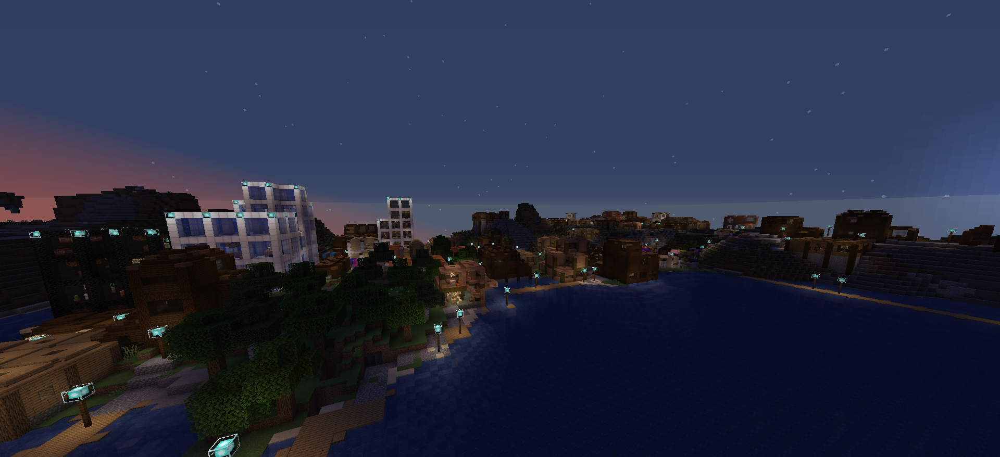
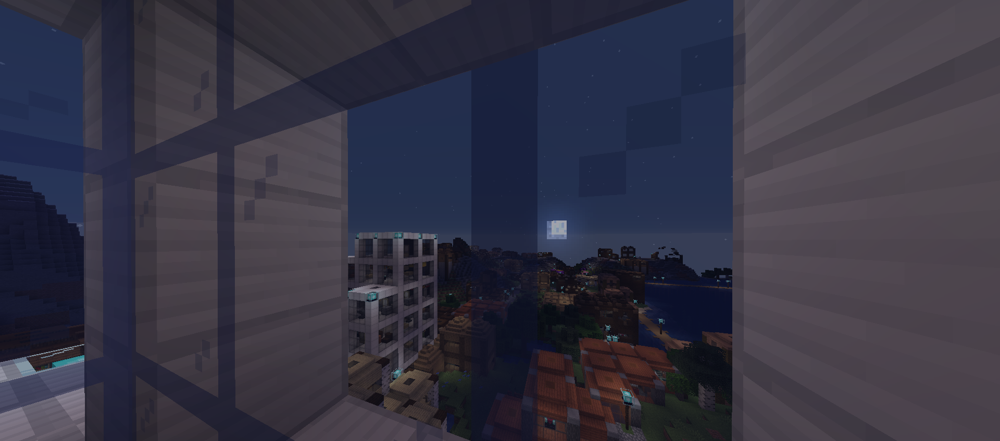
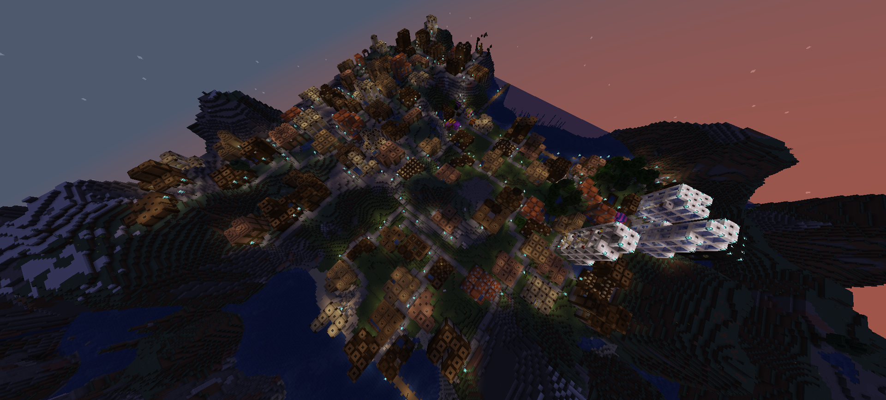
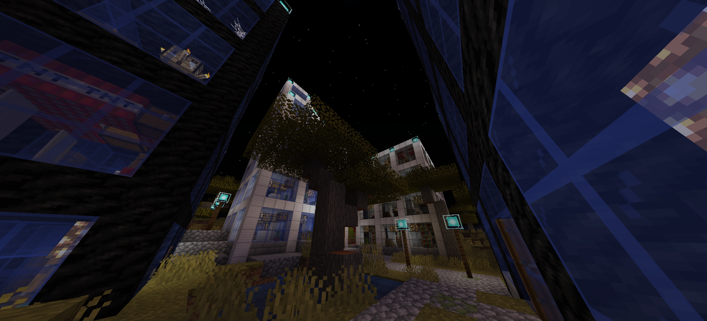
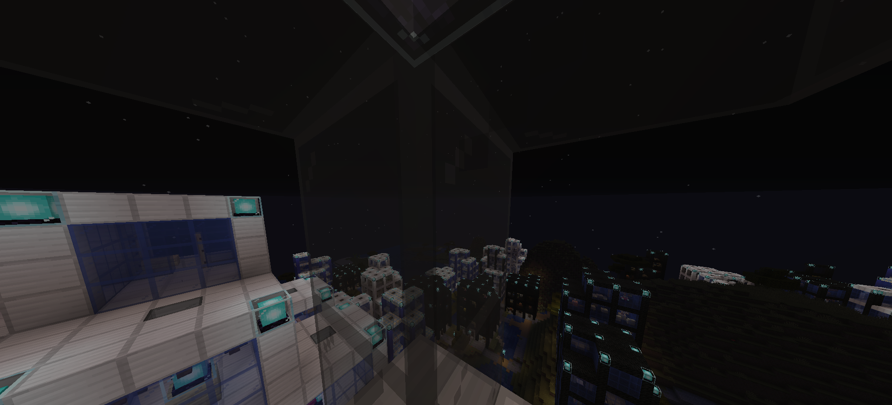
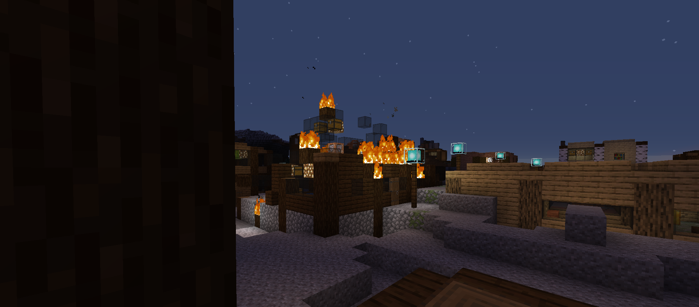

[](https://classroom.github.com/online_ide?assignment_repo_id=448912&assignment_repo_type=GroupAssignmentRepo)
# 🐡 MineTeam 13
👋 Welcome to our repo!

You may find our video, some pictures and instructions on how to run below.
## 🎥 Video
[Video Submission](https://rmiteduau-my.sharepoint.com/:v:/g/personal/s3889401_student_rmit_edu_au/ESTpNrsiQ_1BuQAoOdHnNToBqs57QaOHuuehHu7Ltzh-Rg?e=tbnByR)


## ⏯ How to Run 
Run from village.py

🌞 To experience the city at night/day
- Open server console and write ```/op <your username>```
- In minecraft, press `T` and type:
```
/time set day
```
or
```
/time set night
```
## 🖼 Gallery







*House that spawned with a kitchen fire*
## ✒ Authors
- Rafat Mahiuddin
- Adrian Rebellato
- Harry Porter
- Matthew Wareing